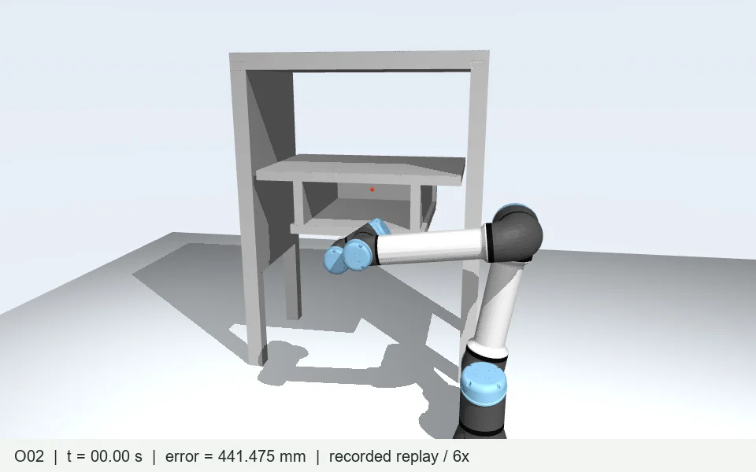

# UR5 Cabinet Experiments

A recorded study of how obstacle representations and online perception affect reaching into a narrow cabinet. The robot uses 65 certificate spheres; environment proxies are spheres or ellipsoids. Controllers include LiuQP and a local position-task adaptation of NEO.

**[Open the interactive experiment website](https://qmoliang.github.io/ur5-cabinet-experiments/)**

**19 attempts · 15 full-duration runs · 4 early terminations.** A completed run is not necessarily a successful reach. Each configuration was attempted once.

## Start here

- Preview the project website: run **python tools/preview.py** from this directory, then open http://localhost:8765.
- [Full experiment overview](reports/experiment-overview.md): measurements, failure mechanisms and the original archive layout.
- [Code map](docs/assets/code-map.md): which component owns each part of the loop.
- [Website metrics](docs/data/experiments.json): all 19 outcomes, error curves and map publication times.
- [Recorded trajectories](evidence/index.json): configuration, completion and timing metadata.
- [Asset and dependency notices](THIRD_PARTY_NOTICES.md).

The website provides synchronized recorded videos, physical/certificate views, a time slider, error curves and result filters. It does not execute a controller in your browser.

## Research documents

[Open the research document library](https://qmoliang.github.io/ur5-cabinet-experiments/library/).

The library contains the user-selected English expanded Word theory guide and 32 original Markdown documents: mathematical derivation, code reading, historical 4.x / 5.x studies, experiment 7, NEO comparisons and current batch reports. Each Markdown has a readable web page with equations, tables and diagrams. Original files are downloadable without byte changes; their provenance and SHA-256 hashes are listed in [the document manifest](docs/library/manifest.json).

- [English expanded Word guide](https://qmoliang.github.io/ur5-cabinet-experiments/library/pages/chapter1-word.html)
- [Ellipsoidal LiuQP derivation](https://qmoliang.github.io/ur5-cabinet-experiments/library/pages/ch02.html)
- [Code reading guide](https://qmoliang.github.io/ur5-cabinet-experiments/library/pages/ch03.html)

Historical versions are labeled separately from the current 19-case batch. Some archive-only paths are retained as text rather than broken web links. One unmatched closing brace in the chapter 2 source is normalized for web typesetting only and noted on the page; the downloadable source remains unchanged.

The committed HTML is generated with **node tools/build_library.mjs**. **tools/collect_library.py** refreshes the chosen originals from the original local workspace; it is not needed to view or rebuild the committed HTML. Rendering components are version-pinned and served locally, with their licenses in docs/library/vendor.

## Main observations

| Configuration | Final position error | Reach confirmed |
| --- | ---: | ---: |
| Known LiuQP, spheres (K01) | 314.165 mm | No |
| Known LiuQP, ellipsoids (K02) | 0.000620 mm | 16.72 s |
| Known NEO, spheres, 46 mm influence (N04) | 312.717 mm | No |
| Known NEO, ellipsoids, 46 mm influence (N02) | 0.000183 mm | 6.04 s |
| Online LiuQP, spheres (O01) | 273.042 mm | No |
| Online LiuQP, ellipsoids (O02) | 0.005167 mm | 21.34 s |
| Online NEO, ellipsoids, no manipulability term (A03) | 0.502953 mm | 6.42 s |

Reach confirmation requires position error below 1 mm for 50 consecutive 20 ms steps. The 46 / 300 mm settings are NEO obstacle influence distances, not proxy radii.

These observations concern this scene and these settings. They do not establish universal ellipsoid superiority or paper-level controller rankings. Online runs follow different trajectories and observe different point clouds.

## Repository layout

    docs/                    Static GitHub Pages site; only this folder is deployed
      assets/                18 short recorded videos, posters, downloadable guides
      data/experiments.json  19-case display data
    experiment/
      batch.py               Schedules the fixed case list
      run_case.py            Selects an isolated runtime and invokes its runner
      runtimes/known/        Known geometry LiuQP / NEO implementations
      runtimes/historical/   Historical 4.3 / 4.4 pipelines
      runtimes/online/       Current perception, controllers and NEO adaptations
      assets/                Canonical scene and UR5 visualization assets
    evidence/<case>/         Saved joint states, error arrays and public metadata
    reports/                 Audit outputs, archive overview, SHA-256 manifest
    tools/                   Website export, public packaging and verification

## What is reproducible here?

The static website works with any local HTTP server and needs no JavaScript build tools.

The third-party quadprog Windows binary is omitted; install quadprog 0.1.13 separately for an appropriate runtime. The public snapshot includes 362 byte-verified files from the formal runtime manifest, scene assets, and joint/error trajectories for all 19 cases. These support source inspection and numerical reanalysis. The full workstation archive also contains large pair tables and causal proxy histories; those are not included in this compact snapshot. Website videos were rendered from those original saved histories at 6 times simulation speed. Online updates are rendered at their recorded publication times.

**A clean-machine controller rerun is not yet validated.** Frozen runtimes include Windows native components, workstation paths and processor-affinity settings. Dependencies and rebuilding require a separate portability pass. The original prepare.py is an archival scene-preparation script, not a public installation command. Do not interpret the source snapshot as a tested one-command reproduction.

The runner applies kinematic joint integration. The recorded clearance audit checks robot certificate spheres against cabinet boxes across recorded intervals. It does not establish continuous self-collision, floor or physical hardware safety.

## Open research issues

- Online map age during control is substantial: median 4.36 s for O01 and 1.80 s for O02.
- MVT uses only layers 4 and 5 in these maps. Assignment combines obstacle AABB extent and the robot query extent; finer indexing alone cannot remove perception delay.
- Current O02 retains very flat ellipsoid cores. Historical 5.1 measurement-support ellipsoids and ET30 minimum-thickness trials are separate experiments, not members of this 19-case batch.
- Online observability conditions still fail. Sphere runs include QP iteration-limit events, and four NEO configurations terminate early.
- NEO here is an adapted position-task implementation, not a full reproduction of its paper.

## Publish with GitHub Pages

1. Create or select the intended GitHub repository and push this directory to its main branch.
2. In the repository, select **Settings → Pages → Build and deployment → Source → GitHub Actions**.
3. Run the **Publish experiment website** workflow (or push a change under docs).

The included workflow uploads only docs. Source, audit and trajectory files remain in the repository. See [GitHub's official workflow documentation](https://docs.github.com/en/pages/getting-started-with-github-pages/using-custom-workflows-with-github-pages).

## Provenance and licensing

The source corresponds to the grounded cabinet rerun dated 2026-09-17. Original frozen hashes are retained in experiment/formal_runtime_manifest.json; reports/public-file-manifest.json covers the copied source and evidence.

Third-party assets and vendored components retain their included licenses. No additional repository-wide license has been selected for the original research code; publication alone does not grant a new blanket license.

