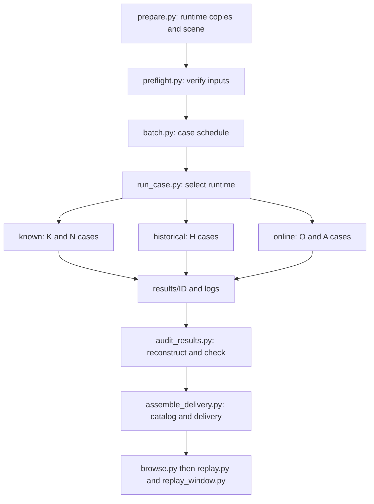
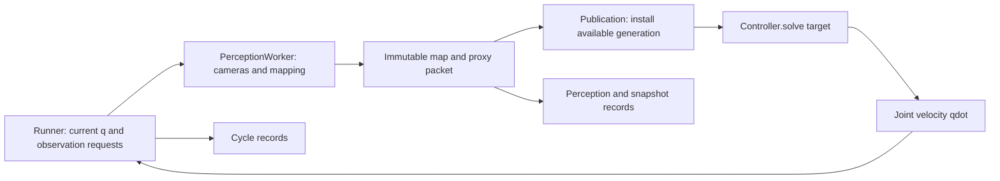

# Archived experiment overview

This document describes the complete original Windows experiment directory. The public repository is a compact snapshot: large pair-state tables, full proxy histories, local launcher files, and workstation outputs are omitted. Paths and links below refer to that original archive; use the repository README for the public layout and supported commands.

---

# UR5 Cabinet Experiments: Known Geometry and Online Perception

**Status: 19 fresh attempts, including 15 complete 60-second runs and four aborted runs.** This directory contains the rerun with four physical cabinet supports included in collision geometry, camera observations, and environment modeling.

The research question is: **How do environment representation, map freshness, and collision-query efficiency affect a robot reaching into a narrow cabinet?** We compare sphere and ellipsoid representations with LiuQP and a local adaptation of the NEO position-task controller.

Several ellipsoid configurations reach and hold the target. **The complete online sensing and certificate protocol has not yet passed.** Task completion, solver reliability, physical clearance, proxy clearance, and timely observation are separate results.

## Contents

1. [How to present the experiment](#1-how-to-present-the-experiment)
2. [Scene and experimental scope](#2-scene-and-experimental-scope)
3. [Directory organization](#3-directory-organization)
4. [Who calls whom and who controls motion](#4-who-calls-whom-and-who-controls-motion)
5. [Experiment groups and results](#5-experiment-groups-and-results)
6. [Open issue: map publication latency](#6-open-issue-map-publication-latency)
7. [Open issue: MVT layer concentration](#7-open-issue-mvt-layer-concentration)
8. [Failures and evidence boundaries](#8-failures-and-evidence-boundaries)
9. [Replay and visualization](#9-replay-and-visualization)
10. [Verification and reading order](#10-verification-and-reading-order)

## 1. How to present the experiment

> We study a UR5 reaching a target inside a narrow cabinet. Conservative obstacle representations can reduce the available clearance and block a passage that exists in the physical scene. We represent the robot with certificate spheres and compare sphere and ellipsoid environment proxies. At each control step, a multilevel voxel table selects nearby candidates, a distance kernel evaluates relevant robot-obstacle pairs, and a quadratic program computes joint velocities. We first evaluate known geometry, then use two robot-mounted depth cameras to build the environment online. Current ellipsoid configurations demonstrate successful reaching, while online map freshness and the benefits of multilevel indexing remain unresolved research issues.

The feedback loop is:

**Robot configuration -> depth observations -> map and proxy updates -> published snapshot -> MVT candidate search -> distances and collision constraints -> QP joint velocity -> next configuration.**

Known-environment experiments replace observation and mapping with a precomputed volume cover of the physical cabinet. MVT is a spatial index: the proxy builder determines sphere radii and ellipsoid shapes before the index assigns layers. MVT neither fits the shapes nor generates robot motion.

## 2. Scene and experimental scope

- Eight original cabinet boxes plus four physical supports: **12 obstacle boxes**.
- Original cabinet dimensions, initial joint configuration, target, UR5 kinematics, and **65 robot certificate spheres** are retained.
- Camera mounts, orientations, fields of view, 320 x 180 resolution, and pixel stride of 1 are retained. Each online run captures fresh observations along its own executed trajectory.
- Official UR5 meshes provide the appearance. The original robot collision geometry still defines collision and camera self-occlusion; visual meshes are not a new certified robot model.
- Known-environment covers are rebuilt as **388 proxies**, with complete solid sub-box coverage verified through corner-containment checks.
- This is a custom cabinet task; its visual style does not make it the original IRIS 4Shelves benchmark.

The preflight found 1,824 support-related depth returns at the initial pose. Saved camera-source poses give 3,493 / 3,389 / 3,840 / 3,812 support returns for H01 / H02 / O02 / A03. These observations cover visible surfaces of two supports; physical presence of all four does not imply complete observation of all four.

### Keep three types of geometry separate

| Object | Role | Owner |
|---|---|---|
| Physical geometry | Scene, depth generation, and independent physical checks | `assets/scene.xml`, `assets/scene.json`, runtime scene builders |
| Geometric certificates | Robot spheres and environment proxies used for collision constraints | Robot certificate builder and known-volume/online proxy builder |
| Display geometry | Bodies, proxies, and uncertainty components shown on screen | `replay.py`, `replay_window.py` |

Online control receives observed proxies rather than all ground-truth cabinet boxes. Ground-truth geometry generates simulated measurements and supports independent audits. The online runs use `unknown_policy='observed_only'`: unobserved space is not universally a hard obstacle.

These are **kinematic joint-velocity experiments**. The runner advances `q_next = q + qdot * 0.02` and evaluates the resulting MuJoCo state. The experiments do not establish torque-control performance or hardware tracking guarantees.

[The parent archive](../README.md) preserves older experiments with a unified appearance and decorative supports. This directory contains fresh runs with physical supports. Use this directory's results for the new scene; older records remain preserved.

## 3. Directory organization

Paths below are relative to this README. The three runtime directories are isolated implementations for different experiment families, not three successive processing stages.

```text
rerun_grounded_20260917/
  README.md                    Explanation and navigation
  plan/                        Protocol, review records, preflight lock
  assets/                      Canonical XML/JSON scene and UR5 visual meshes
  prepare.py                   Builds isolated runtimes and scene inputs
  preflight.py                 Checks one runtime's geometry and observations
  preflight/                   Saved known/historical/online checks
  batch.py                     Sequential schedule of 19 fixed cases
  run_case.py                  Dispatches one case to the correct runtime
  runtimes/
    known/                     Known-volume LiuQP and NEO
    historical/                Frozen 4.3 ellipsoid / 4.4 sphere pipelines
    online/                    Current online pipeline and NEO adapters
  results/<ID>/                Consolidated evidence for each new attempt
  smoke/                       Short preflight/debug runs, outside formal results
  logs/                        Experimental console logs
  audit_results.py             Independent trajectory/failure reconstruction
  audits/                      Aggregated audits and source-integrity evidence
  assemble_delivery.py         Original catalog/report/viewer generation script
  catalog.json                 Case groups, paths, and replay metadata
  comparison.json              Old/new values, solver statuses, audit details
  browse.py                    Chinese launcher: selects and starts replay
  replay.py                    Loads recorded states and causal proxy snapshots
  replay_window.py             MuJoCo rendering, mouse controls, keyboard input
  01_*.cmd ... 05_*.cmd         Replay launchers for the five groups
  previews/                    Presentation and display-check images
  figures/                     Plotting script and result figures
  tables/                      Tabulated outputs
  verify_delivery.py           Checks frozen sources, results, and scene identity
  verification/                Result hash seal and verification reports
  *_manifest.json              Preparation and formal source manifests
  source_changes.json          Recorded preparation changes
  batch_progress.json          Dispatch progress and attempt records
  current_case.json            Dispatcher status, not a scientific result
```

Existing supporting filenames are retained: [full result table](实验结果总表.md) and [viewer instructions](如何查看球和椭球.md).

### Where to find evidence

| File or location | Meaning and producer |
|---|---|
| `results/<ID>/run_identity.json` | Dispatcher identity, runtime, scene hash, completion/error information |
| `results/<ID>/summary.json` | Runner summary when available; independent audit determines the normalized result |
| `results/<ID>/A-CV-*/` | Online/historical recording directory when present |
| `cycles.csv`, `q_history.npy`, `ee_history.npy` | Original control diagnostics and state records |
| `perception_frames.csv` | Timings, source/publish timestamps, proxy counts, and available MVT statistics |
| `causal_proxy_snapshots.npz` | Proxy generations with their source and publication cycles |
| `causal_source_configurations.npz` | States from which camera observations were generated |
| Other `causal_*_snapshots.npz` | Occupancy, CenterVox, and observability evidence where saved |
| `proxies.npz` | Static known-environment proxy set where available |
| `failure.json`, `failed_qp.npz`, `neo_pre_step_q.npy` | Applicable failure diagnostics and pre-step states |
| `independent_new_scene_audit.json`, `audited_q.npy`, `audited_error_mm.npy` | Independent audit and normalized trajectory |
| `replay_q.npy`, `replay_error_mm.npy`, `presentation.xml`, `case.json` | Delivery files derived from audited records and the new scene |

Not every attempt has every file. Aborted cases without proxy history explicitly show that it is unavailable; replay never substitutes another run's map.

Runtime trees contain inherited scripts and internal output folders. A filename mentioning another experiment version is not another formal attempt in this batch. The authoritative case list is `catalog.json`, and consolidated evidence is under `results/<ID>/`.

## 4. Who calls whom and who controls motion

### 4.1 Experiment orchestration



This diagram shows artifact-production order. Preparation, preflight, audits, and delivery are separate stages, not one recursive invocation. `batch.py` directly starts `run_case.py` in a separate Python process for each case.

| Cases | Actual dispatch route | Selected controller |
|---|---|---|
| K01/K02 | `run_case.py` -> `runtimes/known/run.py::run` | Known-volume LiuQP sphere/ellipsoid |
| K03 | Dispatcher -> `known/tests/run_sphere_same_qp_slsqp.py` | Same-QP sphere solver validation |
| N01-N03 | Dispatcher -> `known/external_neo/run_comparison.py::run_case` | LiuQP reference, NEO ellipsoid 46/300 mm |
| N04/N05 | Dispatcher -> `known/external_neo/sphere_study/experiment.py::run_case` | NEO sphere 46/300 mm |
| H01/H02 | Dispatcher -> `historical/run.py::load_case` and `arguments` -> `pipeline.run_one` | `src/v43_ellipsoid/pipeline.py` or `src/v44_sphere/pipeline.py` |
| O01-O06 | Dispatcher -> `online/external_neo_adaptive/run_study.py` -> `run_protocol_v3_async_online.py::run_one` | LiuQP for O01/O02; replacement `OnlineNEO` factory for O03-O06 |
| A01-A03 | Dispatcher -> `online/external_neo_adaptive/ablation_no_manip/run_ablation.py` -> shared study runner | `NoManipNEO` removes the manipulability term; Hessian and hard constraints retained |

Grounded H cases call the loader and `run_one` directly. They do not use historical `run.py::main`, which still checks the earlier scene hash. Process isolation prevents identically named modules from different runtimes being mixed.

### 4.2 Online feedback and authority



1. **Runner owns execution.** `run_protocol_v3_async_online.py::run_one` initializes the task, maintains the joint state, requests observations, publishes packets, calls the controller, integrates velocity, and records outcomes.
2. **Perception owns map construction.** `PerceptionWorker` uses a separate model/state at the requested observation pose. It captures depth, updates occupancy and CenterVox data, constructs proxies, verifies coverage, and returns an immutable serialized packet. It cannot command the robot.
3. **Publication controls information availability.** Source time identifies the observation pose; publication time identifies when information becomes available to control. `_materialize_packet`, `_prepare_publication`, and `_update_controller` install the available generation. MVT is audited in perception and rebuilt/materialized from the transferred snapshot in the receiving process.
4. **Controller owns the velocity decision.** It computes robot sphere positions/Jacobians, queries candidates, evaluates distances, assembles the QP, and returns `qdot` and metrics.
5. **Runner applies the velocity.** Formal online cases use `sweep_guard_mode='audit_only'`: sweep checks can flag evidence failures but cannot scale or replace the command. Execution is `q_next = q + qdot * DT`, with `DT=0.02 s`.
6. **Motion changes future observations.** Different controllers generate different camera trajectories, map content, and publication schedules. These are independent closed loops, not identical-point-cloud controller ablations.

### 4.3 Core module responsibilities

| Module, relative to `runtimes/` | Responsibility | Consumer |
|---|---|---|
| `known/src/known_volume.py` | Solid subdivision, volume covers, coverage checks | Known runners |
| `known/src/core/robot.py` | Robot model, state, kinematics, 65-sphere certificate | Known runners; replay certificate helpers |
| `known/src/core/controller.py` | LiuQP collision processing and QP | Known LiuQP runner |
| `known/src/core/voxel_index.py` | Native MVT wrapper | Known runner/controller |
| `known/src/core/geometry.py`, `known/src/core/native_support.py`, `known/native/collision.cpp` | Geometry and native distance kernels | Controller and wrappers |
| `online/model.py`, `online/protocol_drawer_scene.py` | State/model helpers and task parameters | Runner, worker, controller |
| `online/depth_camera_perception.py` | Simulated depth capture and filtering | Perception worker |
| `online/native_occupancy.py` | Incremental occupancy and map interfaces | Perception and certificate checks |
| `online/incremental_proxy_manager.py` | Persistent CenterVox data and adaptive proxy updates | Perception worker |
| `online/pointcloud_proxy.py`, `online/ellipsoid_model.py`, `online/irredundant_proxy_cover.py` | Fitting, shape support, coverage selection | Proxy manager and geometry pipeline |
| `online/run_protocol_v3_online_ablation.py` | Shared AABB and MVT construction helpers | Asynchronous runner |
| `online/native_mvt.py`, `online/native_mvt/native_mvt.cpp` | Multilevel tables and native candidate filtering | Perception/publication and geometry processing |
| `online/protocol_liuqp_controller.py` | LiuQP objective, constraints, QP solve, pair records | Controller factory and control loop |
| `online/native_ellipsoid_support.py` | Native geometry interface | Distance and collision processing |
| `online/external_neo_adaptive/neo_online.py` | Local NEO QP, index updates, diagnostics | Replacement factory in `run_study.py` |
| `online/external_neo_adaptive/ablation_no_manip/run_ablation.py` | Objective-term ablation in `NoManipNEO.assemble` | A cases |

`OnlineNEO` reuses infrastructure through inheritance from `ProtocolLiuQPController`, but implements its own NEO formulation. Inheritance does not mean that LiuQP's objective remains active. NEO-specific index updates occur on the control thread and are recorded separately. Its 46/300 mm influence range differs from LiuQP's 40 mm near distance.

**Auditing and replay do not control the formal trajectory.** `audit_results.py` evaluates saved states. `browse.py` chooses recordings. `replay.py` loads states and time-matched proxies; `replay_window.py` renders them and handles input. Selecting sphere/ellipsoid loads a different recorded case rather than recomputing the current trajectory.

## 5. Experiment groups and results

| Group | Cases | Question |
|---|---|---|
| Known LiuQP | K01-K03 | How does representation affect reaching with full obstacle knowledge? Does the same-QP solver check change the sphere result? |
| Historical pipelines, rerun | H01-H02 | How do frozen 4.3/4.4 pipelines behave with physical supports and fresh observations? |
| Known NEO | N01-N05 | Does the representation effect persist with the local NEO adaptation? |
| Current online comparison | O01-O06 | What happens when each controller builds its own map causally? |
| Manipulability ablation | A01-A03 | How does removing the NEO manipulability term affect reaching and feasibility? |

**4.3 is ellipsoid; 4.4 is sphere.** H01/H02 are fresh runs of historical pipelines. O01/O02 use the current shared pipeline. **NEO's 46/300 mm values are obstacle influence distances, not proxy radii.**

A reach is confirmed when post-execution position error is strictly below 1 mm for 50 consecutive steps. Confirmation time is simulated trajectory time, not solver runtime. Complete trials continue to 60 s. "Held" below means final task success, not full sensing/certificate protocol success.

| ID | Configuration | Final error (mm) | Outcome | Reach confirmation (s) |
|---|---|---:|---|---:|
| K01 | Known LiuQP sphere | 314.164573 | Not reached | - |
| K02 | Known LiuQP ellipsoid | 0.000620 | Reached and held | 16.72 |
| K03 | Known sphere, same-QP solver validation | 314.164571 | Not reached | - |
| H01 | Historical 4.3 ellipsoid, new scene | 0.095156 | Reached and held | 25.02 |
| H02 | Historical 4.4 sphere, new scene | 257.650439 | Not reached | - |
| N01 | Known LiuQP ellipsoid reference rerun | 0.000620 | Reached and held | 16.72 |
| N02 | Known NEO ellipsoid, 46 mm | 0.000183 | Reached and held | 6.04 |
| N03 | Known NEO ellipsoid, 300 mm | 0.000183 | Reached and held | 6.26 |
| N04 | Known NEO sphere, 46 mm | 312.716553 | Not reached | - |
| N05 | Known NEO sphere, 300 mm | 312.716553 | Not reached | - |
| O01 | Online LiuQP adaptive sphere | 273.042437 | Not reached | - |
| O02 | Online LiuQP ellipsoid | 0.005167 | Reached and held | 21.34 |
| O03 | Online NEO sphere, 300 mm | 369.147935 | Not reached | - |
| O04 | Online NEO ellipsoid, 300 mm | 374.576967 | Aborted | - |
| O05 | Online NEO sphere, 46 mm | 232.074424 | Aborted | - |
| O06 | Online NEO ellipsoid, 46 mm | 370.201639 | Not reached | - |
| A01 | No-manipulability NEO sphere, 300 mm | 260.659817 | Aborted | - |
| A02 | No-manipulability NEO ellipsoid, 300 mm | 343.031284 | Aborted | - |
| A03 | No-manipulability NEO ellipsoid, 46 mm | 0.502953 | Reached and held | 6.42 |

### Relationship to earlier results

- All eight known-environment runs reproduce their respective old joint trajectories exactly, after fresh rebuilding and execution with 388 proxies. The added supports did not change these solutions; other tasks may behave differently.
- H01 changes from 0.177 to 0.095 mm final error; H02 from 263.724 to 257.650 mm. O01 changes from 256.611 to 273.042 mm; O02 from 0.021 to 0.005 mm.
- K03 has 1,634 successful same-QP fallbacks and zero failed fallbacks; the sphere configuration still does not reach.
- Old A03 reached and subsequently left the tolerance, ending at 1.525 mm. New A03 confirms reach at 6.42 s, holds through the end, and finishes at 0.503 mm, with 2,729 final consecutive qualifying cycles. Its new asynchronous trajectory does not establish that the supports fixed the old map-update issue. The old 41.96 s map event is not part of this trajectory.

Full comparisons are in [comparison.json](comparison.json). Each configuration was attempted once; case counts are not statistical success rates. NEO here is a local position-task core adaptation, not the authors' complete software and recovery mechanisms. A03 is an ablation, not the unmodified NEO result.


## 6. Open issue: map publication latency

### Control frequency and map frequency are different

The nominal control period is 20 ms (50 Hz). Control can continue using the last published map while perception works. A configured camera request rate of 30 Hz therefore does not imply 30 new proxy maps per second.

The following values are recomputed from O01/O02 perception and cycle CSV files. Publication frequency uses the runner's recorded wall-clock rate; map ages use logged simulation-cycle timestamps.

| Metric | O01: adaptive spheres | O02: ellipsoids |
|---|---:|---:|
| Published maps in the 60 s trial | 21 | 51 |
| Mean publication rate, wall clock | 0.33 Hz | 0.82 Hz |
| Age at publication, median | 3.00 s | 1.24 s |
| Age during control, median | 4.36 s | 1.80 s |
| Age during control, maximum | 6.06 s | 3.04 s |

**Publication age** measures source-observation to publication delay. **Age during control** measures source-observation to the current control cycle; it increases while a published map is reused. Even with a stationary cabinet, robot motion reveals new surfaces. Delayed publication makes those observations available to collision constraints late.

### Where the time goes

Mean timings over published perception frames:

| Stage | O01: adaptive spheres | O02: ellipsoids |
|---|---:|---:|
| Proxy management/construction | 1569.3 ms | 800.0 ms |
| Proxy coverage verification | 1251.5 ms | 282.4 ms |
| MVT construction/audit stage | 5.8 ms | 3.5 ms |

The proxy-update total contains management and coverage-check work. Other stages may overlap, so summing all stage means does not give end-to-end latency. The principal measured cost is proxy construction/management and coverage verification, rather than MVT construction alone.

Published-frame statistics exclude work still in flight or not published by termination. These are measurements of these runs, not repeated benchmark estimates. Source records are under [O01](results/O01/) and [O02](results/O02/), especially `perception_frames.csv` and `cycles.csv` in their `A-CV-*` subdirectories.

**Next evaluation:** preserve coverage guarantees while assessing local refitting, reuse of unaffected coverage evidence, and publication scheduling. Report control timing and map age separately. Changes to stale-map handling need a new protocol and runs.

## 7. Open issue: MVT layer concentration

### Layer number, proxy size, and sensing resolution differ

The current MVT base width is 15 mm. Code levels are zero-based; explanatory layers below are one-based.

| Layer | Code level | Cell width |
|---|---:|---:|
| 1 | 0 | 15 mm |
| 2 | 1 | 30 mm |
| 3 | 2 | 60 mm |
| 4 | 3 | 120 mm |
| 5 | 4 | 240 mm |

Higher layers have larger cells. A sphere in layer 5 does not have a 240 mm radius or diameter. An index cell width is also not the occupancy-map or CenterVox resolution.

### Actual assignment rule

[The C++ implementation](runtimes/online/native_mvt/native_mvt.cpp) chooses the finest level satisfying, with a small numerical slack:

```text
cell_width(level) > maximum_query_half_extent + maximum_proxy_AABB_half_extent
cell_width(level) = 15 mm * 2^level
```

Each proxy occupies one cell at one level. The rule ensures that an overlapping query can find it in the query-center cell or one of its 26 neighbors. Arbitrarily moving proxies to finer cells without changing the query neighborhood could miss candidates.

For the current LiuQP online cases, [the shared builder](runtimes/online/run_protocol_v3_online_ablation.py) uses:

```text
maximum_query_half_extent
  = maximum_robot_certificate_radius
    + near_distance + safety_margin + motion_padding + numerical_padding
  = 61.8466 mm + 40 mm + 6 mm + 0 mm + 0.005 mm
  = approximately 107.8516 mm
```

The indexed obstacle AABB receives another 0.005 mm outward padding. These numerical paddings affect indexing, not collision geometry. This formula describes the shared LiuQP index; NEO can rebuild its own index for its influence distance.

**Even a point-sized proxy cannot enter the first three layers under this query bound:** 107.85 mm already exceeds layer 3's 60 mm cell width.

For a sphere, effective radius equals AABB half-width before numerical padding:

| Effective sphere radius | Query half-width plus radius, approximately | Layer |
|---:|---:|---:|
| 5 mm | 112.85 mm | 4: 120 mm cells |
| 10 mm | 117.85 mm | 4: 120 mm cells |
| 20 mm | 127.85 mm | 5: 240 mm cells |
| 30 mm | 137.85 mm | 5: 240 mm cells |

The sphere-radius boundary is approximately 12.14 mm after indexing paddings. Different small spheres can therefore occupy just two adjacent layers.

### Recorded distribution

| Final map | Layer 4 | Layer 5 | Total proxies |
|---|---:|---:|---:|
| O01: adaptive spheres | 530 | 3277 | 3807 |
| O02: ellipsoids | 282 | 2063 | 2345 |

Only layers 4 and 5 contain proxies across every published O01/O02 frame. O01's effective sphere radii range from approximately **5.21 to 29.91 mm** across saved snapshots; the snapshot-entry median is approximately **18.89 mm**. This counts entries across snapshots rather than distinct physical objects.

Adaptive spheres are not identical. Their size range, combined with a common query bound, maps into only two bins.

[The adaptive builder](runtimes/online/incremental_proxy_manager.py) limits local over-approximation: beyond certified per-cell measurement support and residual coverage, each candidate receives at most one CenterVox diagonal of extra geometric budget. For 7.5 mm CenterVox cells this is about 12.99 mm. Oversized candidates are subdivided before coverage selection. Adaptation responds to covering needs, not a requirement to populate all layers.

Ellipsoids may be thin normal to a surface but long tangentially. Index assignment uses maximum world-axis AABB half-width, so a thin ellipsoid does not automatically occupy a fine layer.

### Interpretation and next evaluation

- MVT performs candidate selection, but the recorded cases exercise only two nonempty adjacent layers.
- Logs report five allocated levels and 135 cell lookups per robot query (`5 * 27`); this is not five populated layers.
- Occupancy alone does not measure acceleration. Compare candidate counts, query time, memory, and zero-missed-candidate checks against full scan and a suitable single-level table on identical snapshots and queries.
- `runtimes/online/radius_binned_mvt.py` is a query-radius-class prototype, not the table selected by the current shared `_build_mvt_only` helper. It replicates proxy references across classes and lacks the single native handle expected by the current fused kernels.
- Radius classes may reduce coarse-layer concentration, but do not automatically populate fine layers: even the smallest robot sphere plus the current near distance and safety margin yields about **64.87 mm**, greater than layer 3's 60 mm width.

First benchmark frozen snapshots and queries; then assess radius classes, empty-layer traversal, or a different neighborhood policy with no-miss verification. Filling more layers is not itself the objective. Changing base width merely to rename layers is not evidence of a speedup.

## 8. Failures and evidence boundaries

### Four aborted attempts

| Case | Executed duration | Final recorded error | Verified failure |
|---|---:|---:|---|
| O04 | 14.04 s | 374.577 mm | Distance-kernel KKT residual about `1.256e-7`, above the fixed `1e-7` threshold |
| O05 | 3.30 s | 232.074 mm | Infeasible collision-avoidance velocity constraints |
| A01 | 3.18 s | 260.660 mm | Infeasible collision-avoidance velocity constraints |
| A02 | 5.90 s | 343.031 mm | Infeasible collision-avoidance velocity constraints |

Independent HiGHS linear programs for O05/A01/A02 find the full hard-constraint set infeasible, the set without obstacle rows feasible, and obstacle rows alone infeasible. A02's `infeasible fixed workspace row` message is generic and does not identify the workspace boundary as the cause.

O04 stopped in geometry evaluation before a new QP was assembled. Its saved candidate QP is from the previous assembly and is marked in `failed_qp_validity.json`; it cannot establish feasibility at the failing state. Tolerances were not relaxed to convert the attempt into a success.

### Physical checks and remaining protocol failures

Independent audits find no physical penetration at saved states in all 19 attempts. Continuous 6 mm clearance between robot certificate spheres and all 12 true boxes passes over recorded intervals under linear joint interpolation. Aborted cases cover only their executed prefixes. This does not prove continuous self-collision clearance, floor clearance, or dynamic/hardware tracking safety.

| Reaching case | Late / never-observed samples | Controller p99 | Remaining issue |
|---|---:|---:|---|
| H01 | 55 / 7 | 20.764 ms | Observability fails; p99 exceeds 20 ms |
| O02 | 7 / 7 | 11.816 ms | Observability fails |
| A03 | 71 / 8 | 6.827 ms | Observability fails |

These are observability sample counts, not counts of delayed or dropped map packets. Physical clearance and online proxy clearance also differ: sampled minimum proxy gaps include 2.881 mm for H01 and 5.419 mm for A03, despite zero recorded sweep failures. See [the independent audit](audits/results.json) for probe scope and exact values.

H02 records 2,823 OSQP maximum-iteration steps and one `primal infeasible inaccurate` step; O01 records 2,842 and one respectively. Their non-reaching outcomes cannot be attributed exclusively to proxy geometry.

### Supported conclusions

1. In this task and these configurations, known-environment ellipsoids reach with both local controller implementations; tested spheres do not.
2. Historical 4.3 and current online LiuQP ellipsoids also reach after fresh observation and mapping.
3. Known-environment NEO performance does not transfer directly to the online setup. Geometry-kernel failures, infeasible constraints, and objective trade-offs are different mechanisms.
4. Removing the manipulability term produces final task success in this A03 run; sensing evidence remains incomplete.
5. General superiority of a shape or controller, global path infeasibility, and statistical reliability are not established by this batch.

## 9. Replay and visualization

Double-click [the experiment browser](打开新场景实验总览.cmd), or open a group:

| Launcher | Initial case |
|---|---|
| [Known LiuQP](01_已知环境LiuQP.cmd) | K02 |
| [Historical 4.3/4.4](02_历史管线4.3和4.4.cmd) | H01 |
| [Known NEO](03_已知环境NEO.cmd) | N02 |
| [Current online comparison](04_在线LiuQP与NEO.cmd) | O02 |
| [Manipulability ablations](05_去可操作度消融.cmd) | A03 |

Direct replay starts with opaque physical bodies. The browser's certificate-view button starts with certificates only. Keys work in both the replay window and Chinese panel:

| Key | Action |
|---|---|
| F1 | Physical cabinet and robot only |
| F2 | Environment proxies and robot certificate spheres only |
| F3 | Bodies plus certificates; cabinet remains opaque |
| B / H | Toggle cabinet body / robot visual body independently |
| O / R | Toggle environment proxies / robot certificates independently |
| V | Toggle all certificates, preserving body visibility |
| 1 / 2 | Paired sphere / ellipsoid case for the current controller configuration |
| Left / Right, or `[` / `]` | Previous / next case in the group |
| Space / 0 | Pause or resume / restart |
| N / F / S | One step / final pose / first confirmed reach |
| M | Next published online map, then pause |
| T | Optional cabinet transparency; off by default |
| C / U | Original robot collision geometry / separate uncertainty component |

Use the selector when a case lacks a counterpart in the current group. Pair selection does not silently change the controller or NEO influence distance. Left mouse drag rotates, right drag translates, and the wheel zooms.

Orange-red shapes are environment spheres, blue shapes are ellipsoid cores, and green spheres are robot certificates. Separately drawn `Q` and `U` are not the full Minkowski-sum envelope. Known maps stay fixed; online proxies change at their recorded publication cycles. The panel shows map number, count, source time, and publication time.

Replay uses forward kinematics on recorded states and never calls a controller. The normalized trajectory includes the initial state; map selection respects the relation between a post-step frame and its control cycle.

## 10. Verification and reading order

### Verify this delivery

The recorded Windows environment is `D:\anaconda3\envs\simple\python.exe`; launchers accept `CABINET_PYTHON` as an override. From this directory in PowerShell:

```powershell
& 'D:\anaconda3\envs\simple\python.exe' -B .\verify_delivery.py
& 'D:\anaconda3\envs\simple\python.exe' -B .\replay.py --check
& 'D:\anaconda3\envs\simple\python.exe' -B .\browse.py --check
```

These write verification reports without rerunning control or replacing sealed experiment results.

| Evidence | Purpose |
|---|---|
| `formal_runtime_manifest.json`, `audits/source_integrity.json` | Formal source identity: 363 locked files unchanged through the batch |
| `runtime_manifest.json`, `source_changes.json`, `plan/preflight-lock.json` | Preparation and preflight provenance |
| `verification/result_file_manifest.json` | Saved-result and log hash seal |
| `verification/delivery_check.json` | Delivery verification |
| `verification/replay_check.json` | Recorded-position and causal-map checks |
| `verification/keyboard_display_check.txt` | Actual-window shortcut/display checks |
| `audits/known_old_new_trajectory.json` | Pointwise known-environment old/new comparison |
| `preflight/*.json` | Scene, robot, camera, support visibility, and known-cover checks |

Earlier archive and original-location evidence were checked across 480 files. Display scripts and this README can evolve independently of the frozen runtime and sealed scientific results; documentation/display edits do not imply a new experiment.

### New experiments and regeneration

Use a new isolated runtime/output directory and a new protocol. `prepare.py` refuses an already prepared runtime. `batch.py` preserves and skips attempts with existing identities, including failures; `run_case.py` refuses an existing case directory. Reissuing this batch is not a fresh repeat of all 19 cases.

Native Windows libraries, absolute asset paths, and machine-specific CPU-affinity settings require explicit validation when moving computers. Smoke truncation is not uniformly implemented across dispatcher branches; inspect the selected runner rather than assuming `--smoke` shortens every case.

`audit_results.py` writes reconstructed evidence into result folders. `assemble_delivery.py` is the original one-time builder: it writes catalog/replay artifacts and copies viewer code from the parent archive. **Rerunning it does not preserve later viewer fixes.** Use `verify_delivery.py` for this sealed delivery; regenerate audits or delivery artifacts in a separate workspace.

### Top-down reading order

1. This README and `plan/experiment-protocol.md`: task, comparison scope, evidence conditions.
2. `batch.py`, then `run_case.py`: which code actually runs each case.
3. Known branch: `runtimes/known/run.py`, `src/known_volume.py`, and `src/core/robot.py` before the controller.
4. Online branch: `external_neo_adaptive/run_study.py`, then `run_protocol_v3_async_online.py::run_one`, worker, and publication helpers.
5. Controller `solve`: how an available map becomes joint velocity.
6. Relevant index and geometry calls: MVT and native distance kernels. Understand why a query is needed before studying its numerical iterations.
7. A case's cycle/perception CSVs, snapshots, and independent audit alongside replay.

For a presentation, show the task and feedback loop first, then known representation comparisons, online results, map-age measurements, and the MVT assignment rule. End with measured limitations and the next evaluation. A successful animation is evidence of task completion, not completion of every research condition.
