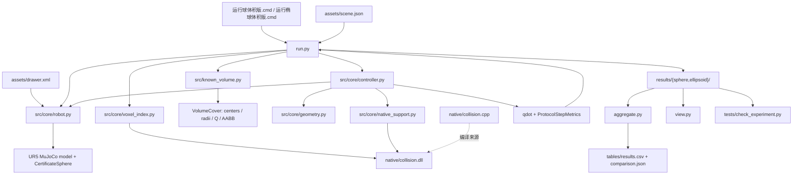
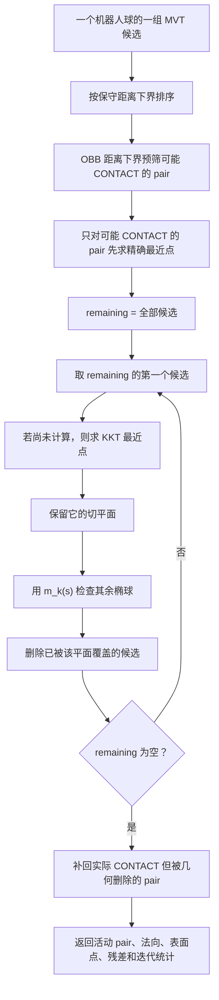

# 第三章 环境已知体积实验代码阅读指南

## 3.1 本章解决的阅读问题

第二章已经给出了机械臂点雅可比、椭球最近点、分离平面、ordered erase-remove 和三状态 QP 的数学定义，但公式仍然是按数学对象组织的。程序执行时，这些对象并不是按照第二章的小节顺序逐个出现，而是被压缩进一次控制周期：程序先取得当前关节状态，再计算全部机器人证书球的位置和雅可比；随后从 368 个环境代理中查询候选，对候选求最近点并删去被已有平面覆盖的冗余代理；保留下来的平面被转换为 QP 行，OSQP 给出关节速度，主循环再用 Euler 步更新关节位置。若直接从 `collision.cpp` 的某个内核向下阅读，读者只能看见数组、索引、Newton、CONTACT 标记和删除循环，却看不到它们在整个周期中的输入来源和输出用途。

本章采用自上而下的阅读方式。阅读的基本单位不是“一个文件”，而是“一个控制周期中数据如何从实验输入变成关节速度”。文件职责、函数调用和第二章公式都挂在这条数据流上。阅读完本章后，应当能够回答三个问题：当前周期已知哪些量；这些量经过哪些几何计算变成 QP；QP 输出如何成为下一周期的状态。

本章只解释 `D:\MuJoCo\LiuQP_known_volume` 的环境已知完整体积实验。该实验不使用深度相机、点云、CenterVox 或在线占据地图。第二章中含方向不确定性矩阵 \(U_j\) 的一般支持和推导保留为控制器能力，但当前运行没有向控制器传入 `obstacle_uncertainty_shapes`，因此 \(U_j=0\)。识别“代码具备某条分支”和“本实验实际执行某条分支”的区别，是本章最重要的阅读原则之一。

## 3.2 先把整个实验压缩成一句话

该实验把抽屉的 8 个已知实体盒确定性地切成 368 个相同子盒集合，再分别用球或椭球完整外包每个子盒；两组运行使用同一个 UR5e、同一个初始关节构型、同一个最终 Cartesian 目标、同一套 LiuQP 状态机和 QP，只改变环境代理的几何形状。每个 20 ms 周期中，控制器根据当前状态重新构造局部线性安全约束，求解关节速度并前进一步。程序最终比较两种完整体积外包是否允许同一局部控制器到达目标。

这里没有预先生成的路径。`scene.json` 虽然使用字段名 `waypoints`，但当前场景只有一个三维点，`run.py` 只读取 `scene.waypoints[-1]` 作为唯一目标。控制器每一周期只看到当前位置和这个最终目标。它既不知道下一周期的构型，也不知道抽屉通道对应的全局同伦路径。

可以把实验分成静态初始化和重复控制两部分：

\[
\underbrace{\text{场景}\rightarrow\text{完整体积代理}\rightarrow
\text{机器人证书}\rightarrow\text{MVT 索引}\rightarrow\text{控制器}}_{\text{只构造一次}}
\]

\[
\underbrace{q_k\rightarrow\text{运动学}\rightarrow\text{候选代理}\rightarrow
\text{精确几何}\rightarrow\text{活动平面}\rightarrow
\text{QP}\rightarrow\dot q_k\rightarrow q_{k+1}}_{\text{每 20 ms 重复一次}}.
\]

## 3.3 文件引用关系和数据方向

下面的图只画当前实验主线。箭头表示“调用或读取”，不是 Python 包的继承关系。



程序启动时，`run.py` 人工把 `src` 和 `src/core` 插入 `sys.path`，所以这些文件使用的是扁平导入，例如 `from controller import ...`，而不是常见的包内相对导入。真正的 Python 调用关系如下表。

| 调用者 | 被调用模块 | 取得的对象 | 在实验中的作用 |
|---|---|---|---|
| `run.py` | `known_volume.py` | `build_volume_cover`、`coverage_audit` | 从已知盒体产生公平的球/椭球环境代理 |
| `run.py` | `robot.py` | 场景数据类、MuJoCo 模型、机器人证书、状态更新 | 提供物理模型、当前状态和机器人球树 |
| `run.py` | `voxel_index.py` | `NativeMultilevelMVT` | 为大量环境代理建立宽阶段候选索引 |
| `run.py` | `controller.py` | `ProtocolLiuQPController` | 把目标、运动学和碰撞平面组装成速度 QP |
| `controller.py` | `robot.py` | `certificate_world_state` 等 | 计算式（1）—（13）对应的当前球心和点雅可比 |
| `controller.py` | `native_support.py` | `NativeEllipsoidSupport` | 把 NumPy 数组传给 C++ 批处理内核 |
| `controller.py` | `geometry.py` | 最近点与一般支持法向 | Python 参考/回退路径；当前默认融合路径不执行它 |
| `voxel_index.py`、`native_support.py` | `collision.dll` | MVT、最近点、筛选函数 | 当前运行的宽阶段与窄阶段高频实现 |
| `view.py`、`aggregate.py`、`tests/*` | `results/*` | 历史构型、代理、逐周期日志和汇总 | 回放、统计和独立验收，不参与生成控制命令 |

`collision.cpp` 与 `collision.dll` 的关系也要区分：Python 实际加载的是 DLL；CPP 是 DLL 的源代码。阅读 CPP 是为了理解 DLL 的行为，修改 CPP 后若不重新编译 DLL，Python 运行结果不会改变。

## 3.4 静态初始化：进入第一个控制周期前发生什么

### 3.4.1 `run.py::load_scene`：读取实验定义

`run.py:47` 读取 `assets/scene.json`，构造 `SceneDefinition`。文件给出 8 个抽屉/柜体盒、初始关节角 \(q_0\) 和唯一末端目标。盒体数据被 `known_volume.py` 用来构造碰撞证书；`robot.py::build_model` 则从 `assets/drawer.xml` 加载 MuJoCo 物理场景。

这意味着实验中存在两个必须保持一致的场景层：

1. `scene.json` 描述用于 LiuQP 的已知环境盒体；
2. `drawer.xml` 描述用于 MuJoCo 正向运动学和最终物理接触审计的实体。

`coverage_audit` 证明代理覆盖 `scene.json` 中的盒体，并不单独证明 JSON 盒体与 XML geom 完全相同。当前实验把两份资产冻结并记录哈希，以固定这一契约。以后若修改场景，应同时检查这两层，不能只看覆盖审计。

`SceneDefinition.duration` 在当前 `run.py` 主循环中没有控制运行时长；实际循环长度由 `MAXIMUM_CYCLES=3000` 决定，因此模拟时长为 \(3000\times0.02=60\) s。

### 3.4.2 `known_volume.py`：把 8 个实体盒变成 368 个凸代理

`subdivide_known_boxes` 按最大边长 75 mm 沿三个坐标轴切分每个闭盒。若原盒半尺寸为 \(h=(h_x,h_y,h_z)\)，每个轴的分块数为

\[
n_a=\max\!\left(1,\left\lceil\frac{2h_a}{0.075}\right\rceil\right),
\qquad
h_a^{\mathrm{cell}}=\frac{h_a}{n_a}.
\]

球组和椭球组共享同一批子盒中心、半尺寸、所属原盒编号和 `proxy_id`。差别只发生在 `build_volume_cover` 中：

\[
r_j=\lVert h_j\rVert_2,
\qquad
Q_j=\operatorname{diag}\!\left(3h_{jx}^2,3h_{jy}^2,3h_{jz}^2\right).
\]

球半径是子盒半对角线。椭球的三个半轴为 \(\sqrt 3h_j\)，即 \(\sqrt{\lambda_a(Q_j)}\)。这里的 `ellipsoid_shapes` 正是第二章式（E-A2）—（E-A3）的形状矩阵 \(Q_j\)；当前代理轴与世界坐标对齐，所以 \(R=I\)。椭球的 AABB 半尺寸也是 \(\sqrt3h_j\)。

`coverage_audit` 检查每个子盒的 8 个顶点。对球计算顶点距离除以半径；对椭球计算

\[
v^TQ_j^{-1}v.
\]

若 8 个顶点都不超过 1，由于球、椭球和子盒都是凸集，整个子盒都在对应代理内。该检查回答“代理是否完整覆盖实体”，不回答“代理是否紧”“机器人能否通过”或“QP 是否可达”。

### 3.4.3 `robot.py`：建立物理模型和机器人证书球

`build_model` 从 XML 建立 `MjModel`；`set_configuration` 写入 \(q\)，把速度清零，然后执行 `mujoco.mj_forward`。后者更新刚体位姿、site 位置和 MuJoCo 接触数据，但不替 LiuQP 求解速度。

`build_robot_certificate` 遍历 UR5 的 box、capsule 和 cylinder geom，并用一组外包球覆盖这些几何体。每个 `CertificateSphere` 保存所属 body、局部球心和半径。这个过程只在启动时执行一次。

`certificate_world_state` 在每个周期执行。它用当前 body 位姿把局部球心变换到世界坐标，并调用 `mujoco.mj_jac` 得到每个球心的三维平移雅可比 \(J_{p,i}\)。这对应第二章式（1）—（13）：程序没有手写 UR5 的齐次变换链，而是让 MuJoCo 计算同一个运动学映射及点雅可比。

### 3.4.4 `voxel_index.py`：建立宽阶段 MVT

`run.py:132` 用所有代理的中心和 AABB 构造 `NativeMultilevelMVT`。查询半径额外包含

\[
d_{\mathrm{near}}+d_{\mathrm{safe}}+\varepsilon_{\mathrm{out}}
=0.04+0.006+5\times10^{-6}\ \mathrm m.
\]

MVT 把不同尺寸的代理分配到不同体素层。每层查询机器人球中心所在格及相邻的 \(3^3=27\) 个格，再用球到 AABB 的欧氏距离条件剔除明显不相交的代理。AVX2 一次比较 8 个 AABB，只改变比较吞吐量。

MVT 的输出是候选代理 ID。它既不计算椭球最近距离，也不产生 QP 行，更不判断 NORMAL、NEAR 或 CONTACT。可以把它理解为通讯录索引：它快速返回“哪些代理值得进入精确几何阶段”，而不会回答这些代理究竟有多近。


#### 3.4.4.1 当前 368 个代理是否真的需要“多层”MVT

当前代理尺寸种类确实很少。球组只有 6 种半径，约为 48.08--53.70 mm，所以球的 AABB 几乎同样大。椭球组也只有 6 种轴对齐 AABB 尺寸组合；其半尺寸各分量约在 25.98--62.07 mm 之间，形状方向不同，但尺度仍处于同一数量级。

实际 MVT 统计进一步说明：球组和椭球组的 368 个代理全部位于 level 4，对应体素边长约 0.24 m；level 0--3 的代理数均为 0。5 个已创建层的代理计数都是

\[
(0,0,0,0,368).
\]

因此，本实验没有利用“不同尺寸代理分配到不同层”的优势。每组只占用 36 个空间哈希单元，真正仍在发挥作用的是单个有效层上的按位置索引：即使代理大小相同，中心仍分布在抽屉底板、侧壁、顶板和柜体各处，查询只访问当前机器人球附近的空间单元，不必对每个机器人球扫描全部 368 个代理。

是否需要 MVT 要分两层回答。算法正确性不依赖 MVT；用一个执行相同球--AABB 包含判据的 \(O(N)\) 暴力宽阶段，也能返回相同候选。当前共有 65 个机器人证书球，完全扫描需要每周期执行 \(65\times368=23920\) 次廉价 AABB 检查，这在本规模下未必不可接受。MVT 避免这次全扫描，并允许候选数组留在 C++ 中直接进入融合最近点与 prune 内核，但它也要执行哈希单元查询。没有专门的 MVT--暴力宽阶段消融，不能仅凭代码结构断言 MVT 在 368 个近等尺寸代理上一定更快。

保留 MVT 的主要工程理由是沿用冻结控制器的查询接口、避免为这个小实验另写一套热路径，并保持方法可扩展到更多、尺寸跨度更大的代理。若本章只解释几何因果，MVT 可以被理解为可替换加速器；球与椭球差异的核心证据来自完整体积代理形状及其生成的活动 QP 平面，不来自 MVT。

代码中的 0.04 m 也不是完整查询半径。它是 `NEAR_DISTANCE`，随后与安全余量和浮点外扩相加：

\[
p_{\mathrm{query}}
=0.04+0.006+0.000005
=0.046005\ \mathrm m.
\]

`query_spheres` 再把每个机器人证书球自己的半径 \(r_i\) 加进去，所以实际传给 C++ 的查询半径是

\[
R_i^{\mathrm{query}}=r_i+0.046005.
\]

当前 65 个机器人球的半径约为 18.87--61.85 mm，对应实际查询半径约为 64.87--107.85 mm。40 mm 表示希望在进入 NEAR 状态前关注的原始表面距离，6 mm 对应 QP 使用的安全膨胀，5 μm 用于吸收 float32 AABB 边界误差。MVT 只用这个膨胀球寻找“可能落入关注范围”的 AABB；候选进入 C++ 后，KKT 最近点才计算真实 \(c_{ij}\) 和 \(h_{ij}\)，状态机再用真实 \(c_{ij}\) 判定 NORMAL、NEAR 或 CONTACT。

### 3.4.5 `ProtocolLiuQPController.__init__`：冻结控制器参数

`run.py:158--160` 根据表示类型传入 `obstacle_radii` 或 `obstacle_shapes`。两组共享安全余量 6 mm、NEAR 阈值 40 mm、CONTACT 阈值 0、同一个 MVT 和同一套 QP 权重。椭球组没有传入不确定性形状，所以当前有

\[
U_j=0,\qquad \delta_j=\texttt{obstacle\_offsets}[j]=0.
\]

`update_obstacles` 对椭球形状矩阵预计算特征值和旋转矩阵，并创建按“机器人球 × 障碍代理”排列的乘子缓存 `_multiplier_dense`。缓存保存上一周期的 \(\lambda^*\)，供本周期 Newton 热启动。控制器还创建 `NativeEllipsoidSupport`，通过 `ctypes` 加载同一个 `collision.dll`。


## 3.5 一个控制周期的完整调用链

`run.py:181` 调用一次 `controller.solve(target)`，得到 \(\dot q_k\)。当前椭球默认路径可以展开为：

```text
run.py::run
└─ controller.py::ProtocolLiuQPController.solve
   ├─ task_feedback
   ├─ robot.py::certificate_world_state
   ├─ joint_velocity_bounds
   ├─ _prefetch_exact_closest_pairs
   │  └─ native_support.py::closest_prune_pairs_mvt_warm
   │     └─ collision.cpp::mvt_ellipsoid_closest_prune_pairs_warm
   │        ├─ mvt_multilevel_query_sphere_impl
   │        └─ ellipsoid_closest_prune_pairs_warm
   │           └─ ellipsoid_closest_points_warm
   ├─ active_planes_for_robot_sphere
   ├─ _persistent_solver_update
   └─ osqp.OSQP.solve
run.py::run
├─ q_after = q_before + qdot * DT
├─ robot.py::set_configuration
└─ 读取 MuJoCo contact，记录日志
```

这里最容易误判的是 `geometry.py`。当前配置同时满足：椭球表示、无方向不确定性、启用 native batch、启用 lazy prune、MVT 含原生 handle。因此 `_prefetch_exact_closest_pairs` 在 `controller.py:399` 直接进入 C++ 融合路径。Python 的 `closest_point_on_ellipsoid` 是清晰的参考实现和关闭批处理后的回退实现，并非本次默认运行中每个 pair 实际经过的函数。

下面按 `solve` 内的数据产生顺序解释一次周期。

### 3.5.1 末端任务反馈：公式（14）—（17）

`task_feedback` 读取当前末端位置 \(x_{ee}(q_k)\)，由 `mujoco.mj_jacSite` 得到 \(J_{ee}(q_k)\)，并计算

\[
v_d=K_p(x_g-x_{ee}).
\]

代码再把 \(\lVert v_d\rVert\) 截断到 0.18 m/s。该函数输出 `ee, ee_jacobian, desired_velocity`。它只给出“如果没有其他约束，希望末端怎样移动”，不直接求逆运动学，也不生成中间目标。

`solve` 把软任务写进 OSQP 的 Hessian 和梯度：

\[
P_0=w_v I+w_tJ_{ee}^TJ_{ee},
\qquad
g_0=-w_tJ_{ee}^Tv_d.
\]

在 OSQP 的标准目标
\(\frac12\dot q^TP\dot q+g^T\dot q\)
下，这等价于第二章公式（25）的速度正则和任务跟踪平方项，忽略与 \(\dot q\) 无关的常数。

### 3.5.2 机器人所有证书球的当前状态：公式（1）—（13）

`certificate_world_state` 返回三个数组：

| 数组 | 形状 | 数学含义 |
|---|---:|---|
| `positions` | \(N_R\times3\) | 每个机器人证书球心 \(p_i(q_k)\) |
| `jacobians_full` | \(N_R\times3\times n_v\) | 每个球心点雅可比 \(J_{p,i}(q_k)\) |
| `radii` | \(N_R\) | 固定机器人球半径 \(r_i\) |

这一步解释了为什么不能把所有障碍约束都乘末端雅可比 \(J_{ee}\)。障碍可能靠近前臂、肘部或腕部，每个机器人球必须使用自己的 \(J_{p,i}\)。

### 3.5.3 关节界：公式（19）—（20）

`joint_velocity_bounds` 同时考虑硬速度界和一步后的位置界：

\[
\max\!\left(-\dot q_{\max},
\frac{q_{\min}+\epsilon_q-q_k}{\Delta t}\right)
\le\dot q\le
\min\!\left(\dot q_{\max},
\frac{q_{\max}-\epsilon_q-q_k}{\Delta t}\right).
\]

代码为 6 个关节各加入一行单位向量。OSQP 允许同一行同时有有限下界和上界，所以这些行直接成为矩阵 \(A\) 的前 6 行。

### 3.5.4 MVT 候选查询：只减少需要检查的 pair

理论上的全 pair 数是

\[
N_RN_O
=\texttt{len(robot\_spheres)}\times368.
\]

若对每个 pair 都求椭球最近点，很多时间会浪费在远处代理上。融合入口 `mvt_ellipsoid_closest_prune_pairs_warm` 对每个机器人球调用 `mvt_multilevel_query_sphere_impl`，查询半径为

\[
r_i+d_{\mathrm{near}}+d_{\mathrm{safe}}+\varepsilon_{\mathrm{out}}.
\]

查询得到的 `obstacle_indices` 由 `group_offsets` 分组：第 \(i\) 个机器人球对应扁平数组区间
\([\texttt{group\_offsets}[i],\texttt{group\_offsets}[i+1])\)。
因此 C++ 可以用一个连续数组表达“许多机器人球各自的一组候选”，避免 Python 对每个球调用一次 DLL。

宽阶段只能保守地多报，不能漏掉进入 NEAR 范围的代理。多报的候选会在精确最近点或 erase-remove 阶段被处理。

### 3.5.5 椭球精确最近点：公式（E-B1）—（E-B11）

对候选 pair \((i,j)\)，机器人球心 \(p_i\) 作为点，环境椭球中心 \(o_j\)、形状矩阵 \(Q_j\) 作为障碍。C++ `ellipsoid_closest_points_warm` 先把点变换到椭球特征坐标：

\[
Q_j=R_j\operatorname{diag}(\mu_1,\mu_2,\mu_3)R_j^T,
\qquad
z=R_j^T(p_i-o_j).
\]

外部点最近点的局部坐标为

\[
y_a(\lambda)=\frac{\mu_a z_a}{\lambda+\mu_a},
\]

其中 \(\lambda\ge0\) 是标量方程

\[
F(\lambda)=
\sum_{a=1}^{3}
\frac{\mu_a z_a^2}{(\lambda+\mu_a)^2}-1=0
\]

的唯一根。这分别对应第二章式（E-B5）和（E-B6）。程序建立根区间，用受保护 Newton 更新；Newton 步离开区间或出现非有限值时改用区间中点，Newton 迭代结束后仍未达容差时继续二分。上一周期同一 pair 的 \(\lambda^*\) 是 `initial_multipliers`，只用于选择更好的初值，不改变方程和最终几何定义。

求根后，程序恢复世界坐标表面点

\[
x_{O,j}=o_j+R_jy(\lambda^*)
\]

及从机器人指向障碍物的单位法向

\[
\tilde s_{ij}
=\frac{x_{O,j}-p_i}{\lVert x_{O,j}-p_i\rVert}.
\]

这对应式（E-B9）—（E-B11）。因此“迭代”并不表示它在试探一条运动路径；它只是在一个当前构型、一个球—椭球 pair 上数值求解精确最近点所需的一维根。

若机器人球心真正进入核心椭球，代码返回一个恢复保护结果：surface 被设为当前点，并用中心方向作 fallback normal。第二章 2.13 已说明，这不是外部点 KKT 推导的精确有符号内部解。正常无穿透运行依赖不进入该分支；调试时应检查 `closest_point_max_residual` 和 MuJoCo 穿透日志。

### 3.5.6 切平面、净空和 QP 硬行：公式（E-C）—（23E）

当前实验 \(\delta_j=0\)，所以最近表面点本身就是平面上的障碍支持点。程序保存

\[
\beta_{ij}=\tilde s_{ij}^Tx_{O,j},
\qquad
c_{ij}=\lVert x_{O,j}-p_i\rVert-r_i,
\qquad
h_{ij}=c_{ij}-d_{\mathrm{safe}}.
\]

`ProtocolSeparatingPlane.clearance` 存的是 \(h_{ij}\)，即已经减去 6 mm 安全余量的净空；`surface_clearance = plane.clearance + safety_margin` 才恢复为尚未减安全余量的 \(c_{ij}\)。

机器人球心一步更新近似为
\(p_i^+\approx p_i+\Delta tJ_{p,i}\dot q\)。
要求一步后不跨过安全平面，可得

\[
\tilde s_{ij}^TJ_{p,i}\dot q
\le \frac{h_{ij}}{\Delta t}.
\]

在 `controller.py:805`，`projected = plane.normal_to_obstacle @ jacobian` 就是行向量
\(a_{ij}=\tilde s_{ij}^TJ_{p,i}\)；
随后 `upper.append(plane.clearance / self.dt)` 写入式（23E）的右端。几何模块输出的是平面，控制器才把平面变成关节速度约束。

### 3.5.7 ordered erase-remove：公式（E-H1）—（E-H6）

一个机器人球的 MVT 候选可能来自同一块墙的许多相邻代理。若每个代理都生成 QP 行，约束数量会增加，而且很多平面表达的是同一个局部阻挡方向。LiuQP 的 ordered erase-remove 依次保留当前排序最靠前的候选平面，并检查该平面是否已经把其他代理整体放在障碍侧。

对保留平面的法向 \(s\) 和偏置 \(\beta\)，候选椭球 \(k\) 在该方向上的最小支持投影为

\[
m_k(s)=s^To_k-\sqrt{s^TQ_ks}-\delta_k.
\]

若

\[
m_k(s)\ge\beta-\varepsilon,
\]

则椭球 \(k\) 整体位于这条平面的障碍侧，该平面已经足以阻止当前机器人球朝它运动，候选 \(k\) 可以从本轮剩余集合删除。这对应第二章式（E-H2）—（E-H5）。代码中的 `support3(shape, normal)` 计算 \(\sqrt{s^TQ_ks}\)，`remaining.swap(kept)` 实现 ordered erase-remove。

“prune”删除的是冗余 QP 候选，并不删除场景实体，也不改变下一周期的 MVT。每个周期会依据新的 \(q_k\) 重新查询和筛选。

### 3.5.8 三状态：公式（E-I2）、（26E）和（27E）

状态分类使用原始表面间隙 \(c_{ij}\)，而不是已经减去安全余量的 \(h_{ij}\)：

\[
\begin{cases}
c_{ij}\ge d_{\min} & \text{NORMAL},\\
0<c_{ij}<d_{\min} & \text{NEAR},\\
c_{ij}\le0 & \text{CONTACT/RECOVERY}.
\end{cases}
\]

三种状态都保留式（23E）的基础硬行。NORMAL 不增加其他项。NEAR 把 \(a_{ij}\) 收集进 `near_matrix`，在 Hessian 中增加

\[
w_nA_n^TA_n,
\]

对应公式（26E）的
\(\frac12w_n\sum(a_{ij}\dot q)^2\)。
这个软项惩罚法向速度，使运动更倾向沿障碍切向滑动。

CONTACT/RECOVERY 不使用 NEAR 软项，而是增加

\[
a_{ij}\dot q\le-v_{\mathrm{rep},ij},
\]

对应公式（27E）。由于 \(\tilde s_{ij}\) 从机器人指向障碍物，负法向速度表示远离障碍。恢复速度随穿入程度增加，并封顶于 `repulsive_speed=0.035` m/s。

### 3.5.9 工作空间边界：公式（21）—（22）

控制器对每个机器人证书球和 6 个轴对齐工作空间面计算

\[
n_f^TJ_{p,i}\dot q
\le\frac{b_f-r_i-n_f^Tp_i}{\Delta t}.
\]

`solve` 使用 `np.einsum` 一次性生成所有工作空间行。`_append_workspace_constraints` 保留了逐球实现，但当前 `solve` 采用向量化代码，没有调用这个辅助函数。

### 3.5.10 OSQP 求解和失败行为：公式（E-I4）

前面得到的目标、关节界、工作空间行、碰撞硬行和 CONTACT 恢复行被写成

\[
\min_{\dot q}\quad
\frac12\dot q^TP\dot q+g^T\dot q,
\qquad
l\le A\dot q\le u.
\]

`_persistent_solver_update` 复用 OSQP 的稀疏矩阵模式，上一周期速度作为 primal warm start；QP 行按
`('collision', robot_index, proxy_id)`
等身份重新匹配 dual warm start。QP 热启动与椭球乘子热启动是两件事：前者猜 \(\dot q\) 和对偶变量，后者猜最近点方程的 \(\lambda\)。

若 OSQP 没有返回 `solved*` 状态，代码输出严格零速度。程序不会随机扰动、切换路点或调用全局规划器。

### 3.5.11 状态更新和只读物理审计：公式（E-J1）—（E-J2）

`run.py:182` 执行

\[
q_{k+1}=q_k+\Delta t\dot q_k.
\]

`set_configuration` 把 \(q_{k+1}\) 写入 MuJoCo 并运行 `mj_forward`。随后主循环读取 `data.contact`，把距离小于 \(-10^{-8}\) m 的接触记为物理穿透。该接触数据用于验收和成功判据，不会回退、裁剪或重写刚才的 \(\dot q_k\)。

成功必须同时满足：末端误差小于 1 mm、当前周期无物理穿透，并连续保持 50 个周期。运行即使提前达到条件也不会 break，而会继续保存完整 3000 周期轨迹，所以 `first_sustained_success_time_s` 和最终误差是不同概念。


## 3.6 `ellipsoid_closest_prune_pairs_warm` 到底在做什么

这个函数名称可以按四段拆开：

- `ellipsoid_closest`：对需要的球心—椭球 pair 求式（E-B6）的精确外点最近点；
- `prune_pairs`：按式（E-H4）执行 ordered erase-remove；
- `warm`：使用上一周期同一 pair 的 \(\lambda^*\) 作为求根初值；
- `pairs`：一次处理多个机器人球及其候选代理，而不是只处理一个 pair。

它不是“用 contact 方法迭代求球—椭球距离”。最近点始终由 KKT 标量根求解。参数 `contact_distance` 只服务于 CONTACT/RECOVERY 状态优先级：几何冗余删除可能使一个接触 pair 被另一平面覆盖，但接触恢复规则要求实际接触 pair 自己的恢复行仍被保留，因此函数要在删除前识别可能接触的 pair，并在删除后把实际接触但被删掉的 pair 加回活动集合。

函数的内部顺序如下。



### 3.6.1 为什么先使用 OBB 下界

每个椭球在自身主轴坐标中都被半轴长度组成的 OBB 包含。对同一个点，

\[
d(p,\mathrm{OBB})\le d(p,\mathcal E).
\]

因此

\[
d(p,\mathrm{OBB})-\delta_j-r_i>d_{\mathrm{contact}}
\]

可以安全推出真实球—椭球表面间隙也大于 CONTACT 阈值。反过来，下界小于阈值只表示“可能接触”，仍需调用精确最近点确认。该预筛可能多算，不会漏掉真实 CONTACT。

### 3.6.2 为什么是 lazy closest

普通批处理可以先对全部 MVT 候选求最近点，再做 erase-remove。融合函数发现许多候选会被第一个或前几个保留平面删除，因此用局部 lambda `solve_local` 延迟计算：只有候选成为当前 `remaining.front()`，或 OBB 下界表明它可能处于 CONTACT 时，才执行 `ellipsoid_closest_points_warm`。这改变计算时机和数量，不改变候选顺序、最近点方程或删除判据。

输出中的 `computed` 表示这个候选本周期是否真的执行了精确求根；`warm_start` 表示求根时是否取到了上一周期的有限乘子；`newton`、`bisection` 和 `residuals` 用于把数值求解质量记录进 `ProtocolStepMetrics`。

### 3.6.3 为什么函数还需要 `group_offsets`

所有机器人证书球的候选被拼成一个长数组。若第 \(i\) 组范围是 \([b_i,e_i)\)，函数只在该范围内排序、求最近点和 erase-remove。不同机器人球之间不能互相删候选，因为它们的中心、半径、法向和点雅可比都不同。OpenMP 并行的是这些独立 group，而不是把一个 pair 的 Newton 方程拆给多个线程。

### 3.6.4 它返回什么，谁消费这些结果

`native_support.py::closest_prune_pairs_mvt_warm` 为 C++ 准备连续缓冲区，并把返回值还原为每个机器人球的一组局部活动索引。控制器随后构造 `ProtocolSeparatingPlane`：

| C++ 输出 | Python 字段或指标 | 后续用途 |
|---|---|---|
| `output_normals` | `normal_to_obstacle` | 构造 \(a_{ij}=\tilde s^TJ_{p,i}\) |
| `output_surfaces` | `surface_point` | 计算平面偏置和净空 |
| `output_active`、`output_counts` | `active_groups` | 决定哪些代理进入 QP |
| `output_multipliers` | `_multiplier_dense` | 下一周期最近点热启动 |
| Newton/二分次数 | `closest_point_*_iterations` | 性能诊断 |
| `output_residuals` | `closest_point_max_residual` | 数值正确性诊断 |
| `output_computed` | 内部统计 | 区分 lazy 跳过和真实求解 |
| `output_warm_start` | `multiplier_warm_start_hits` | 评估跨周期复用 |

该函数不会看到末端目标、雅可比、QP Hessian、关节界或 OSQP。它的输出还不是控制速度，只是“当前机器人球应保留哪些障碍平面，以及这些平面的几何参数”。

## 3.7 每个代码模块应当怎样理解

### 3.7.1 `assets/scene.json` 与 `assets/drawer.xml`

`scene.json` 是实验参数层，定义用于证书构造的盒体、\(q_0\) 和最终目标。`drawer.xml` 是 MuJoCo 模型层，包含机器人和物理障碍 geom。阅读时先核对目标和盒体，再去看 XML；没有必要从 XML 的 mesh、材质或 actuator 细节开始。

### 3.7.2 `src/known_volume.py`

该文件只回答“已知实体怎样变成公平的球/椭球代理”。`VolumeCover` 是静态数据包；`subdivide_known_boxes` 决定共享分块；`build_volume_cover` 决定球半径和椭球 \(Q\)；`coverage_audit` 证明每个子盒被完整包含。它不计算机器人距离，也不参与每周期 QP。

### 3.7.3 `src/core/robot.py`

该文件连接抽象公式和 MuJoCo。场景数据类保存配置；`build_robot_certificate` 建立机器人球树；`certificate_world_state` 把当前 \(q\) 变成所有 \(p_i,J_{p,i},r_i\)；`attachment_position` 和 `mj_jacSite` 支撑末端任务；`set_configuration` 实现主循环的状态提交。这里应重点读坐标系和雅可比，不必先研究碰撞筛选。

### 3.7.4 `src/core/voxel_index.py`

该文件是 `ctypes` 的 MVT 包装。构造函数声明 DLL 接口、创建索引并记录层数等统计；`query_sphere(s)` 把机器人球查询转换为候选 ID；`native_handle` 允许融合内核直接在 C++ 内查询。它是宽阶段加速层，不承担第二章的精确几何证明。

### 3.7.5 `src/core/geometry.py`

该文件最适合用来对照第二章公式，因为 Python 写法比 C++ 缓冲区清楚：

- `support_radius` 对应 \(\sqrt{s^TQs}\)；
- `closest_point_on_ellipsoid` 对应式（E-B1）—（E-B11）；
- `optimal_support_normal_with_uncertainty` 对应式（E-G2）及单位球面优化；
- `optimal_support_separating_normal`、`optimal_support_sum_separating_normal` 是一般形状组合的参考实现。

当前 known-volume 椭球运行没有方向不确定性，并启用原生融合批处理，因此上述 Python 最近点函数通常不处于热路径。正确读法是先用它理解数学和返回量，再去 C++ 查找等价的批量实现。

### 3.7.6 `src/core/native_support.py`

该文件没有新的几何算法。它定义 C 函数签名、检查 NumPy 的 dtype/shape/连续内存，分配输出缓冲区并调用 DLL。当前椭球路径的关键包装是 `closest_prune_pairs_mvt_warm`；非融合备选是 `closest_prune_pairs_warm`；含 \(U_j\) 时才使用 `normals_sum_*_warm`。阅读 `ctypes.argtypes` 时，应把它看作 Python/C++ 的数据契约，而不是数学推导。

### 3.7.7 `native/collision.cpp`

该文件把多个性能模块集中在一个 DLL 中：

| 大致位置 | 模块 | 当前实验作用 |
|---|---|---|
| `mvt_multilevel_create`（约 598 行） | 多层体素索引构造 | 启动时建立宽阶段 |
| `mvt_multilevel_query_sphere_impl`（约 855 行） | 球到 AABB 候选查询 | 每周期筛候选，AVX2 可用 |
| `ellipsoid_closest_points_warm`（约 1537 行） | KKT 标量根最近点 | 当前椭球窄阶段的几何核心 |
| `ellipsoid_prune_planes`（约 1717 行） | 先全求解再筛选 | 备选路径 |
| `ellipsoid_closest_prune_pairs_warm`（约 1798 行） | lazy 最近点 + ordered erase-remove + CONTACT 优先 | 当前融合路径内部核心 |
| `mvt_ellipsoid_closest_prune_pairs_warm`（约 2022 行） | MVT 与上述核心融合 | 当前椭球默认 DLL 入口 |
| `mvt_sphere_prune_pairs`（约 2078 行） | 球代理的等价融合路径 | 当前球组默认入口 |

阅读顺序应从导出入口向内追一层，而不是从文件第一行顺序读到末尾。当前椭球路径只需依次读 2022、1798、1537 附近的三个函数，再回看 855 附近的 MVT 查询。

### 3.7.8 `src/core/controller.py`

这是整个实验的语义中心。数据类 `ProtocolSeparatingPlane` 保存几何输出；`PairRecord` 保存三状态；`ProtocolStepMetrics` 保存周期证据。控制器方法按职责可分为五组：

| 方法组 | 代表函数 | 问题 |
|---|---|---|
| 配置 | `__init__`、`update_obstacles` | 当前障碍表示和缓存是什么 |
| 任务/边界 | `task_feedback`、`joint_velocity_bounds` | 机器人想去哪里、关节允许多快 |
| 几何预取 | `_prefetch_exact_closest_pairs`、`_prefetch_sphere_pairs` | 哪些 pair 进入精确几何并保留 |
| 单球平面 | `active_planes_for_robot_sphere` | C++ 输出怎样变成平面对象 |
| QP | `solve`、`_persistent_solver_update` | 平面、任务和边界怎样变成 \(\dot q\) |

若只精读一个文件，应当精读 `solve`，再按它调用的函数向外展开。

### 3.7.9 `run.py`

`run.py` 是实验编排层。它创建静态对象，重复调用 `controller.solve`，提交 Euler 状态，读取 MuJoCo 接触，保存日志并生成 summary。它决定“实验怎样运行”和“成功怎样定义”，但碰撞数学在 controller/native 内。

### 3.7.10 `aggregate.py`、`view.py` 与 `tests`

`aggregate.py` 只从真实日志汇总球/椭球结果，并把球组 OSQP 迭代上限标记为混杂因素。`view.py` 回放保存的 \(q\) 历史并叠加代理，不重新运行控制器。`tests/check_experiment.py` 重建 368 个共享子盒，复核覆盖规则、日志形状、文件哈希、成功保持和零穿透，并要求鲁棒同 QP 的 SLSQP 验证仍显示球组受阻。

这些文件用于回答“运行结果是否可追溯”，不能用来理解本周期的 \(\dot q\) 是怎样算出来的，所以应当在主控制链之后阅读。

## 3.8 第二章公式到代码的双向索引

| 第二章公式 | 数学对象 | 主要代码位置 | 当前默认执行 |
|---|---|---|---|
| （1）—（13） | 刚体运动学、模块点速度、\(J_{p,i}\) | `robot.py::certificate_world_state`，MuJoCo `mj_jac` | 是 |
| （14）—（17） | 末端误差反馈 \(v_d\) | `controller.py::task_feedback` | 是 |
| （19）—（20） | 关节位置/速度界 | `controller.py::joint_velocity_bounds` | 是 |
| （21）—（22）、（22E） | 工作空间平面一步约束 | `controller.py::solve` 中 `workspace_projected/workspace_upper` | 是 |
| （E-A1）—（E-A5） | 环境椭球及球—椭球集合 | `known_volume.py::build_volume_cover`；controller 的 obstacle arrays | 是，\(U=0,\delta=0\) |
| （E-B1）—（E-B11） | 点到椭球精确最近点 | 参考：`geometry.py::closest_point_on_ellipsoid`；热路径：`collision.cpp::ellipsoid_closest_points_warm` | C++ 路径是 |
| （E-C）—（E-F4） | 表面点、法向、平面、间隙 | `active_planes_for_robot_sphere` 和 C++ 最近点输出 | 是 |
| （23E）、（E-F5） | 碰撞速度硬行 | `controller.py:805--809` | 是 |
| （E-G1）—（E-G12） | 含机器人形状/方向不确定性的支持和 | `geometry.py::optimal_support_normal_with_uncertainty`；`native_support.py::normals_sum_*`；C++ support kernels | 当前 \(U=0\)，不执行一般分支 |
| （E-H1）—（E-H6） | ordered erase-remove | Python `_minimum_support` 回退；C++ `ellipsoid_closest_prune_pairs_warm` 热路径 | 是 |
| （24E）、（25） | 综合 QP 与软任务 | `controller.py::solve`、`_persistent_solver_update` | 是 |
| （E-I2） | NORMAL/NEAR/CONTACT 分类 | `classify_clearance`、`surface_clearance` | 是 |
| （26E）、（E-I3） | NEAR 法向速度代价 | `near_projected_rows`、`near_matrix.T @ near_matrix` | 条件执行 |
| （27E） | CONTACT/RECOVERY 撤离硬行 | `contact_recovery` 行 | 条件执行 |
| （E-I4） | 当前周期完整 QP | `controller.py::solve` 的 \(P,g,A,l,u\) | 是 |
| （E-J1）—（E-J2） | Euler 更新和局部闭环 | `run.py:181--183` | 是 |

反向阅读时也可使用下面的定位规则：

- 看见 `positions/jacobians/radii`，回到公式（1）—（13）；
- 看见 `desired_velocity`，回到公式（14）—（17）；
- 看见 `multiplier`，回到式（E-B5）—（E-B8）；
- 看见 `normal/surface/plane_offset`，回到式（E-C）—（E-F3）；
- 看见 `minimum_support/behind/remaining`，回到式（E-H2）—（E-H5）；
- 看见 `projected/clearance/dt`，回到式（23E）；
- 看见 `near_matrix`，回到公式（26E）；
- 看见 `repulsion`，回到公式（27E）；
- 看见 `hessian/gradient/rows/lower/upper`，回到式（E-I4）；
- 看见 `q_before + qdot * DT`，回到式（E-J1）。

## 3.9 关键变量词典

| 代码变量 | 数学符号 | 含义 |
|---|---|---|
| `target` | \(x_g\) | 唯一末端目标 |
| `ee` | \(x_{ee}(q_k)\) | 当前末端位置 |
| `desired_velocity` | \(v_d\) | 截速后的末端期望速度 |
| `positions[i]` | \(p_i(q_k)\) | 第 \(i\) 个机器人证书球心 |
| `jacobians[i]` | \(J_{p,i}(q_k)\) | 该球心的平移雅可比 |
| `radii[i]` | \(r_i\) | 机器人证书球半径 |
| `obstacle_centers[j]` | \(o_j\) | 环境代理中心 |
| `obstacle_shapes[j]` | \(Q_j\) | 环境核心椭球形状矩阵 |
| `obstacle_uncertainty_shapes[j]` | \(U_j\) | 方向不确定性形状；当前未传入 |
| `obstacle_offsets[j]` | \(\delta_j\) | 各向同性外扩；当前为 0 |
| `normal_to_obstacle` | \(\tilde s_{ij}\) | 从机器人球心指向障碍的法向 |
| `surface_point` | \(x_{O,j}\) | 障碍近侧支持/最近表面点 |
| `offset` | \(\beta_{ij}\) | 平面常数 \(\tilde s^Tx_O\) |
| `surface_clearance` | \(c_{ij}\) | 尚未减安全余量的表面间隙 |
| `plane.clearance` | \(h_{ij}=c_{ij}-d_{\mathrm{safe}}\) | 写入基础硬行的安全净空 |
| `projected` | \(a_{ij}=\tilde s^TJ_{p,i}\) | 碰撞 QP 行 |
| `_multiplier_dense[i,j]` | \(\lambda_{ij}^{*,k-1}\) | 上周期 KKT 根热启动 |
| `previous_velocity` | \(\dot q_{k-1}\) | OSQP primal 热启动 |
| `rows/lower/upper` | \(A,l,u\) | OSQP 线性约束 |
| `hessian/gradient` | \(P,g\) | OSQP 二次目标 |

第二章使用从机器人指向障碍的 \(\tilde s\)，代码字段名 `normal_to_obstacle` 与它一致。若阅读其他资料使用障碍指向机器人的 \(n\)，两者满足 \(n=-\tilde s\)。符号方向翻转时，平面不等式方向和恢复速度符号也必须一起翻转。

## 3.10 从控制输出到实验结论

`run.py` 保存四类核心证据。`q_history.npy` 和 `ee_history.npy` 记录状态轨迹；`proxies.npz` 固定本次使用的代理几何；`cycles.csv` 保存每周期误差、QP 状态、候选数、活动行、几何残差、迭代次数和物理接触；`summary.json` 保存成功判据、时间统计、实验禁用项和源文件哈希。

当前真实汇总中，两组都使用 368 个完整体积代理且 MuJoCo 穿透周期为 0。椭球组达到目标，球组受阻。球组主运行大量达到 OSQP 迭代上限，因此 `tests/run_sphere_same_qp_slsqp.py` 对同一个已组装 QP 使用 SLSQP 回退；回退均成功求解但机器人仍停在相同位置。这个补充实验用于排除“只是 OSQP 没解出来”的解释，不能改写为新的规划算法。

实验允许的结论只针对当前场景、75 mm 共享实体分块和当前 LiuQP 参数：球的各向同性完整体积外包在局部控制中形成闭塞，而同一子盒的椭球外包保留方向相关空间，使控制器通过。它不证明所有球覆盖都会失败，也不证明椭球 LiuQP 具有全局完备性。

## 3.11 推荐的实际阅读顺序

建议把阅读分成六轮，每一轮只回答一个问题。

| 轮次 | 文件和函数 | 本轮只回答的问题 | 对照公式 |
|---:|---|---|---|
| 1 | `run.py:100--228` | 一个实验怎样初始化、循环和判定成功 | （E-J1）—（E-J2） |
| 2 | `controller.py::solve` | 一个周期怎样从 \(q_k,target\) 变成 \(\dot q_k\) | （14）—（27E）、（E-I4） |
| 3 | `robot.py::certificate_world_state` 和 `task_feedback` | \(J_{ee}\) 与各 \(J_{p,i}\) 从哪里来 | （1）—（17） |
| 4 | `known_volume.py`、`voxel_index.py::query_sphere(s)` | 368 个代理是什么，候选集合如何产生 | （E-A1）—（E-A5） |
| 5 | `geometry.py::closest_point_on_ellipsoid` | 单个 pair 的最近点公式怎样落成代码 | （E-B1）—（E-B11） |
| 6 | C++ 2022 → 1798 → 1537 行附近 | 批处理怎样把 MVT、lazy 最近点和 erase-remove 融合 | （E-B6）、（E-H4） |

读完第六轮再看 `native_support.py` 的 `ctypes` 参数和持久化 OSQP 内存复用。它们解释性能，不改变方法语义。`aggregate.py`、`view.py` 和测试留到末尾，用于验证你对数据流的理解。

不建议从 `robot.py` 第一行一路顺序读到 `collision.cpp`。更有效的方式是在 `controller.solve` 中选一行，例如
`active, candidates, removed = ...`，
向下追它如何计算；再回到 `solve` 看返回值怎样变成 QP 行。这种“主流程向下展开、返回主流程继续”的阅读方式仍然是自上而下，只是在每个步骤内部做一次短距离下钻。

## 3.12 建议设置的断点与观察值

第一次调试可以只运行一个周期，把 `--cycles` 设为 1。建议观察下列位置。

| 断点 | 应观察的变量 | 你要验证的理解 |
|---|---|---|
| `run.py:117` | `cover.centers.shape`、`sphere_radii`、`ellipsoid_shapes` | 球/椭球共享子盒，只改变外包形状 |
| `run.py:181` | `q_before`、`target` | 控制器输入只有当前状态和最终目标 |
| `controller.py:722` | `ee_jacobian`、`desired_velocity` | 任务反馈只是 QP 软目标 |
| `controller.py:723` | `positions.shape`、`jacobians.shape` | 每个机器人球都有自己的点雅可比 |
| `controller.py:762` | `exact_batches` | 当前椭球确实走 native fused path |
| `controller.py:779` | `candidates`、`removed`、`active` | MVT 候选与活动 QP 平面不是同一集合 |
| `controller.py:805` | `projected`、`plane.clearance/self.dt` | 式（23E）怎样进入 \(A,u\) |
| `controller.py:812` | `surface_clearance`、`state` | 三状态使用 \(c\)，不是 \(h\) |
| `controller.py:870` | `result.info.status`、`result.x` | OSQP 输出才是关节速度 |
| `run.py:182` | `qdot`、`q_after` | 速度怎样通过 Euler 成为新构型 |

C++ 调试不必作为第一步。先在 Python 侧确认 `exact_batches` 的内容和活动行，再把一个 robot group 的 `obstacle_indices`、`computed`、`output_active` 对应起来。这样进入 `ellipsoid_closest_prune_pairs_warm` 时，你已经知道每个数组的上游来源和下游消费者。

## 3.13 阅读完成后的整体心智模型

这套程序可以被分成三种彼此不能混淆的计算。

第一种是表示计算：`known_volume.py` 把真实盒体变成球或椭球证书。它决定环境几何有多保守，但不产生运动。

第二种是查询与几何计算：MVT 找候选，椭球 KKT 求真实最近点，ordered erase-remove 选活动平面。它们把非线性几何在当前 \(q_k\) 处转换成有限组平面，但不知道任务目标，也不求关节速度。

第三种是控制计算：`controller.solve` 把末端任务、关节界、工作空间界和活动碰撞平面写进 QP，OSQP 得到 \(\dot q_k\)。`run.py` 再更新 \(q\) 并记录 MuJoCo 真值接触。

所以，一个周期的因果链可以写成：

\[
\boxed{
(q_k,x_g,\mathcal O)
\rightarrow
(p_i,J_{p,i})
\rightarrow
\mathcal C_i^{\mathrm{MVT}}
\rightarrow
(x_{O,j},\tilde s_{ij},c_{ij})
\rightarrow
\mathcal S_i^E
\rightarrow
(P,g,A,l,u)
\rightarrow
\dot q_k
\rightarrow
q_{k+1}}
\]

其中，\(\mathcal C_i^{\mathrm{MVT}}\) 是宽阶段候选集，\(\mathcal S_i^E\) 是 erase-remove 后的活动平面集。前者大并且允许多报，后者小并且直接决定 QP。你在 `collision.cpp` 看到的 CONTACT 标记，只是为了保证活动集合不会丢失必须执行恢复的 pair；它不是另一套距离求解器。你在第二章看到的 IRIS-inspired 平面思想，只负责解释分离平面怎样从凸几何产生；当前程序没有运行 IRIS 区域膨胀、削构型空间或区域链规划。

到这里，第二章中的公式就不再是分散的推导：公式（1）—（20）产生任务和运动学，式（E-B6）产生每个候选的真实最近点，式（E-H4）缩减约束，式（23E）、（26E）和（27E）定义三状态下进入 QP 的行或代价，式（E-I4）给出当前周期速度，式（E-J1）把速度推进到下一周期。整个实验就是不断重复这条链，直到达到成功保持条件或耗尽 3000 个周期。


